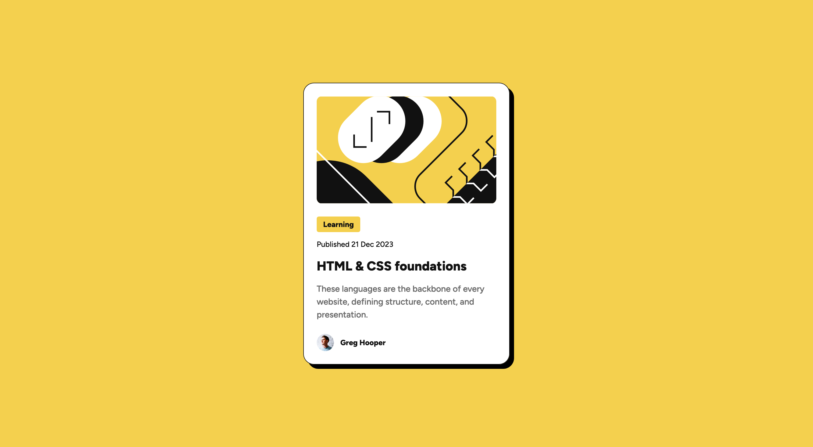

# Frontend Mentor - Blog preview card solution

This is a solution to the [Blog preview card challenge on Frontend Mentor](https://www.frontendmentor.io/challenges/blog-preview-card-ckPaj01IcS). Frontend Mentor challenges help you improve your coding skills by building realistic projects.

## Table of contents

- [Overview](#overview)
  - [The challenge](#the-challenge)
  - [Screenshot](#screenshot)
  - [Links](#links)
- [My process](#my-process)
  - [Built with](#built-with)
  - [What I learned](#what-i-learned)
  - [Continued development](#continued-development)
- [Author](#author)

## Overview

### The challenge

A simple blog preview card webpage.

Users should be able to:

- See hover and focus states for all interactive elements on the page

### Screenshot



### Links

- Solution URL: [Solution](https://github.com/ccorley23/Blog-Preview-Card)
- Live Site URL: [Live Solution](https://ccorley23.github.io/Blog-Preview-Card/)

## My process

For this simple Blog Preview Card challenge, I started with filling out the HTML, making sure to use as many semantic tags as possible, while also making sure each tag was absolutely necessary (no useless tags).

Then, I styled the CSS while referencing the Figma solution. I decided to use utility classes for the text-presets.

### Built with

- Semantic HTML5 markup
- CSS custom properties
- Flexbox

### What I learned

I learned more about which tags to use for certain situations. I realized I was overusing the _p_ tag for situations when other tags would have made more sense semantically.

I learned what the _time_ tag was and when to use it.

```html
<time class="blog-card__date text-preset-3" datetime="2023-12-21">
  Published 21 Dec 2023
</time>
```

I also learned to use other tags when _p_ is not appropriate, such as _span_.

```html
<span class="blog-card__tag text-preset-3-bold">Learning</span>
```

### Continued development

For the future, I want to continue to focus on:

- Making responsive layouts using media-queries and other responsive units
- Making sure I am using the correct semantic tags

## Author

- Developer - [Cristina Corley](https://github.com/ccorley23)
- Frontend Mentor - [@ccorley23](https://www.frontendmentor.io/profile/ccorley23)
- Github - [@ccorley23](https://github.com/ccorley23)
